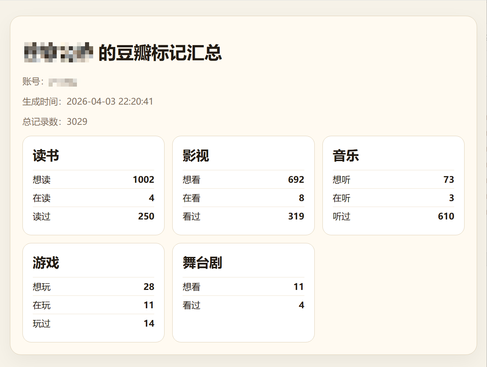
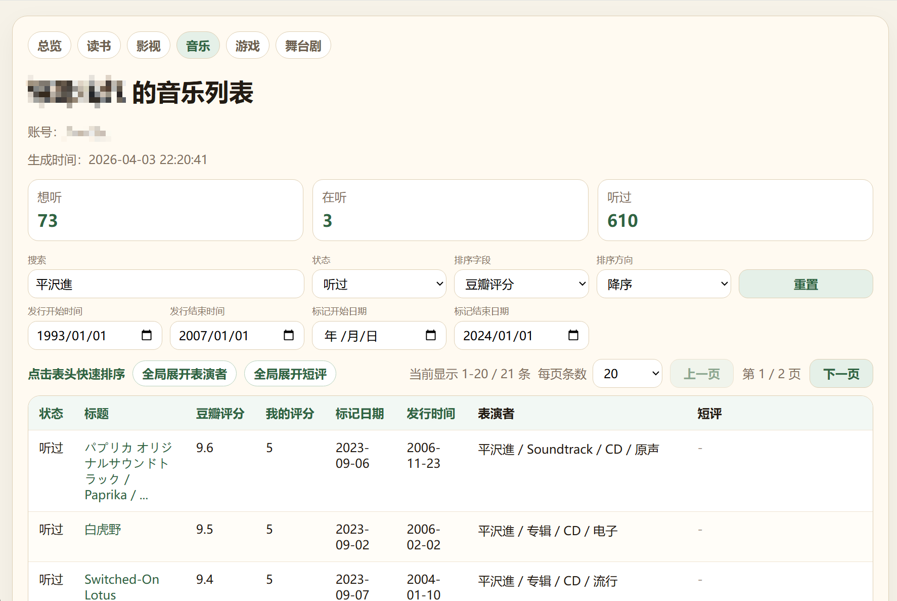
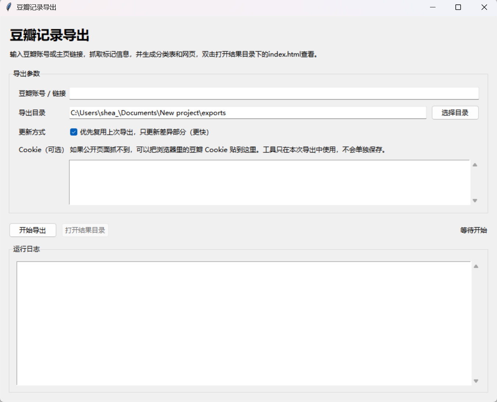

# 豆瓣记录导出

这个工具用于抓取豆瓣账号的标记记录，并导出为 CSV 和方便信息筛选的 HTML 页面。

当前版本支持：

- 读书：想读 / 在读 / 读过
- 影视：想看 / 在看 / 看过
- 音乐：想听 / 在听 / 听过
- 游戏：想玩 / 在玩 / 玩过
- 舞台剧：想看 / 看过

## 主要功能

- 导出总表 CSV、汇总 CSV、分类 CSV
- 生成 HTML 信息汇总页面
- 页面内支持搜索、状态筛选、标记日期范围筛选、作品时间范围筛选、按表头快速排序
- 支持“我的评分”和“豆瓣评分”
- 默认优先使用本地上一次导出做增量更新，减少重复抓取，也可以切换为全量刷新





## 图形界面

直接运行：

- Windows 可执行文件：`dist/douban_record_export.exe`
- 或 `run_exporter.bat`
- 或源码方式：`python app.py`

界面里可以设置：

- 豆瓣账号或主页链接
- 导出目录
- 是否优先复用上一次导出，只更新差异部分
- Cookie（可选）



## 命令行

基础用法（example-user替换为豆瓣账号名）：

```powershell
python app.py --account "https://www.douban.com/people/example-user/" --no-gui
```

常用参数：

- `--output-dir`
- `--cookie`
- `--categories`
- `--statuses`
- `--full-refresh`
- `--no-gui`

示例：

```powershell
python app.py --account example-user --categories book,movie --statuses wish,collect --no-gui
```

强制全量刷新：

```powershell
python app.py --account example-user --full-refresh --no-gui
```

## 导出结果

每次导出会生成一个带时间戳的目录，包含：

- `douban_marks_all.csv`
- `douban_summary.csv`
- `douban_book_marks.csv`
- `douban_movie_marks.csv`
- `douban_music_marks.csv`
- `douban_game_marks.csv`
- `douban_drama_marks.csv`
- `index.html`
- `book.html`
- `movie.html`
- `music.html`
- `game.html`
- `drama.html`

## 主要字段

明细表包含这些核心字段：

- `title`：标题
- `douban_rating`：豆瓣公开评分
- `rating`：我的评分
- `marked_date`：标记日期
- `content_date`：从简介里提取出的最早相关时间
- `intro`：作者 / 演职信息 / 表演者 / 平台类型等
- `comment`：短评

## 增量更新说明

当前版本默认会尝试读取同一导出根目录下、同一账号的最近一次导出结果。

如果网页新数据和旧结果之间能找到稳定重叠区间，就会直接复用旧尾部，只更新差异部分。这样在“最近新增不多”的情况下会明显更快。

如果找不到稳定重叠区间，程序会自动回退到全量抓取，不需要手动处理。